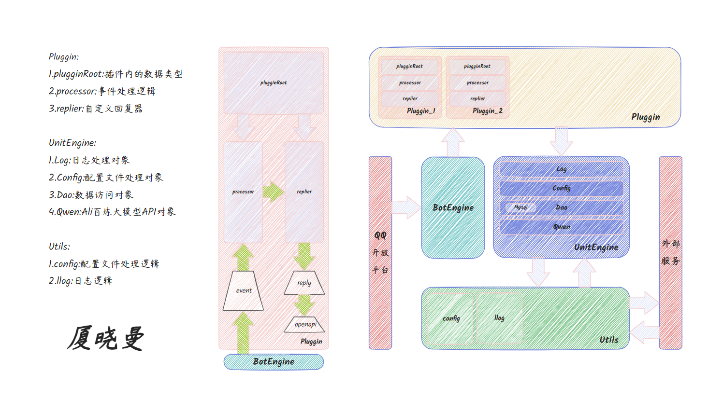

# XiaXiaoMan
#### I really want to join RedRock and become a RedRocker, so I must push myself harder✊✊✊!!!

A QQ-SDK Based QQBot with Golang.

### 厦晓曼

### 执行流程
Engine收到QQ开放平台的消息后调用`ProcessGroupMessage()`函数处理群AT消息，后`ProcessGroupMessage()`将消息`Content`中的内容进行分割，根据`raw[0]`匹配要执行的插件，后由插件的`Processor()`进行业务逻辑处理

### TODO

1. 完善注释覆盖度
2. 完善异常处理
3. 完成阿里百练大模型的api调用对象
4. 写docker-compose.yaml
5. 写含数据库操作的插件demo
6. 写外部操作api（gin）
7. 部署测试